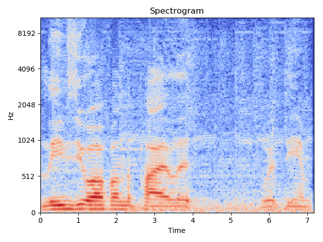
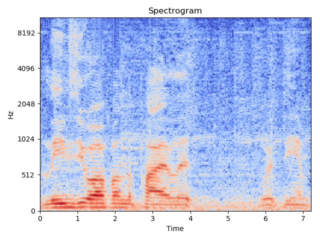

GluonAR: a Deep Learning Toolkit for Audio Recognition
======================================================
Gluon Audio is a toolkit providing deep learning based audio recognition algorithm.
The project is still under development, and only Chinese introduction will be provided.

GluonAR Introduction:
---------------------

GluonAR is based on MXnet-Gluon, if you are new to it, please check out
`dmlc 60-minute crash course <http://gluon-crash-course.mxnet.io>`_.

虽然名字叫GluonAR, 但是目前以及可以预见的时间内只有Text-Independent
Speaker Recognition的内容.

已经实现的feature:
    - 使用ffmpeg的pythonic binding ``av``\ 和\ ``librosa``\ 做audio数据读取
    - 模块支持\ ``Hybridize()``. forward阶段不使用pysound, librosa, scipy, 效率更高, 提供快速训练和end-to-end部署的能力, 包括:
        - 基于\ ``nd.contrib.fft``\ 的短时傅里叶变换(\ ``STFTBlock``)和z-score block, 相比使用numpy和scipy预处理后载入GPU训练效率提高12%.
        - ``MelSpectrogram``, ``DCT1D``, ``MFCC``, ``PowerToDB``
        - `1808.00158 <https://arxiv.org/abs/1808.00158>`_\ 中提出的\ ``SincBlock``

    - gluon风格的VOX数据集载入
    - 类似人脸验证的Speaker Verification
    - 使用频谱图训练声纹特征的例子, 在VOX1上的1:1验证acc: 0.941152+-0.004926

example:

.. code:: python

   import numpy as np
   import mxnet as mx
   import librosa as rosa
   from gluonar.utils.viz import view_spec
   from gluonar.nn.basic_blocks import STFTBlock

   data = rosa.load(r"resources/speaker_recognition/speaker0_0.m4a", sr=16000)[0][:35840]
   nd_data = mx.nd.array([data], ctx=mx.gpu())

   stft = STFTBlock(35840, hop_length=160, win_length=400)
   stft.initialize(ctx=mx.gpu())

   # stft block forward
   ret = stft(nd_data).asnumpy()[0][0]
   spec = np.transpose(ret, (1, 0)) ** 2
   view_spec(spec)

   # stft in librosa
   spec = rosa.stft(data, hop_length=160, win_length=400, window="hamming")
   spec = np.abs(spec) ** 2
   view_spec(spec)

输出:

+-------------------+-------------------+
| STFTBlock         | STFT in librosa   |
+===================+===================+
| |img1|            |  |img2|           |
+-------------------+-------------------+

更多的例子请参考\ ``examples/``.

.. toctree::
   :hidden:

   install
   datasets
   pretrained_model
   api/index
