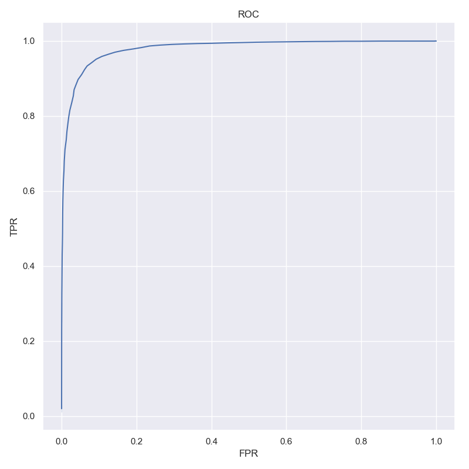

Pretrained Models
=================

Speaker Recognition
-------------------

ResNet18 training with VoxCeleb
^^^^^^^^^^^^^^^^^^^^^^^^^^^^^^^

Download: `Baidu <https://pan.baidu.com/s/1Gkhi67oJSiSyAiYNTdPlTw>`__,
`Google
Drive <https://drive.google.com/open?id=1oEvSQrnNwYL4pRyQ8t87hRP3m22wuePz>`__

I followed the ideas in paper **VoxCeleb2**
`1806.05622 <https://arxiv.org/abs/1806.05622>`__ to train this model,
the differences between them:

+----------+---------------------+---------------------+
|          | Res18 in this repo  | Res34 in paper      |
+==========+=====================+=====================+
| Trained  | VoxCeleb2           | VoxCeleb2           |
| on       |                     |                     |
+----------+---------------------+---------------------+
| Input    | 224x224             | 512x300             |
| spec size|                     |                     |
+----------+---------------------+---------------------+
| Eval on  | Random 9500+ pair   | Original VoxCeleb1  |
|          | samples from        | test set            |
|          | VoxCeleb1           |                     |
+----------+---------------------+---------------------+
| Metric   | Accuracy: 0.932656  | EER: 0.0504         |
|          | +- 0.005187         |                     |
+----------+---------------------+---------------------+
|Framework | Mxnet Gluon         | Matconvnet          |
+----------+---------------------+---------------------+
| ROC      | |img1|              |                     |
+----------+---------------------+---------------------+

